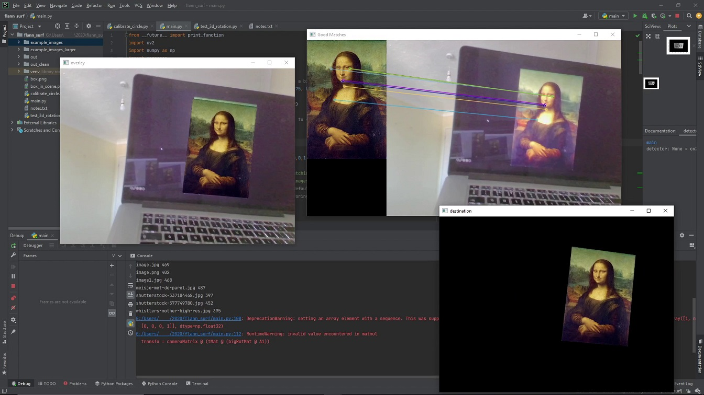

# Painting tracker

Simple image tracking test, using webcam input, and ORB and FLANN.

Place the images in example_images on a different device, and run test_3d_rotation.py. While displaying the images on the screen of the second device, hold it in front of the webcam of the first, and the image will be overlaid onto its perceived location and pose in the frame.
Example use [here](https://drive.google.com/file/d/1JNGEYOxNNIiHniayBBaRhMJSqB2qQRRn/view?usp=sharing)

Tested on Windows, should work on other platforms.